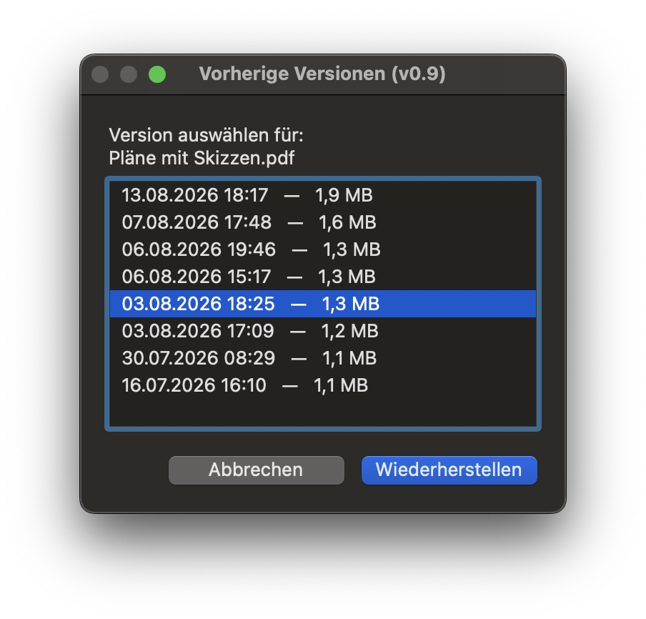
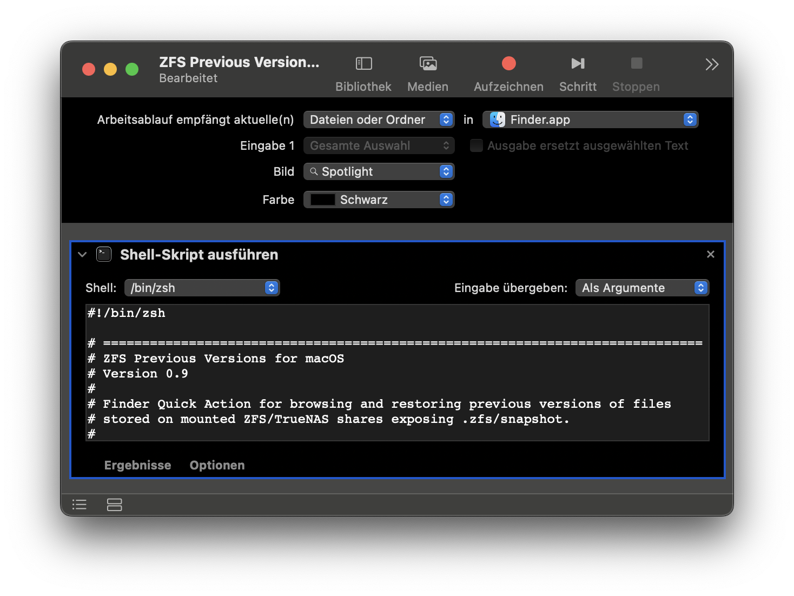

# ZFS Previous Versions for macOS

**Version 0.9 — Preview**

A lightweight Finder Quick Action for browsing and safely restoring previous file versions from **TrueNAS/ZFS snapshots on macOS**.

It provides a macOS alternative to the convenient **“Previous Versions”** feature available for SMB shadow copies on Windows.

No Xcode, Homebrew, Python or third-party application is required.


     
---

## Features

* **Native Finder integration**
  Right-click a file and choose **Quick Actions → ZFS Previous Versions**.

* **TrueNAS / ZFS snapshot support**
  Reads previous versions directly from the mounted share's `.zfs/snapshot` directory.

* **Automatic volume detection**
  No server name, share name or mount path is hard-coded.

* **Shows actual file versions instead of every snapshot**
  Consecutive snapshots containing the same file modification time and size are collapsed into a single entry.

* **Fast parallel snapshot scanning**
  Metadata requests are performed in parallel. This can significantly improve responsiveness on SMB connections with higher latency, including VPN/WireGuard connections.

* **Native macOS interface**
  Available versions are shown in a standard macOS selection dialog with modification date and file size.

* **Automatic localization**
  German and English are currently included. The interface language is detected automatically from macOS. Additional languages can be added through the localization dictionary without changing the program logic.

* **Safe restore behavior**
  The original file on the network share is never modified or overwritten.

* **Restores to Downloads**
  Restored versions are created as separate files in `~/Downloads`.

* **Snapshot timestamp in the restored filename**
  For example:

  `report.docx`

  restored from:

  `auto-2026-08-07_15-00`

  becomes:

  `report_2026-08-07_15-00.docx`

* **Preserves the original modification timestamp**
  The restored copy keeps the timestamp stored in the snapshot.

* **No silent overwrites**
  Existing files in the restore destination are never replaced.

* **Optional byte-for-byte verification**
  By default, the restored file is compared against the selected snapshot version before it is presented to the user.

* **Automatically reveals the restored file**
  After a successful restore, Finder opens the Downloads folder and selects the restored file.

* **Self-contained Automator workflow**
  The complete script can be embedded directly inside the `.workflow` file. No separate scripts or runtime dependencies are required.

---

## Requirements

* macOS

* A mounted filesystem/share containing ZFS snapshots

* Snapshot access through:

  `.zfs/snapshot`

* Finder access to the snapshot directories

The project is primarily intended for **TrueNAS SMB shares**, but there are no hard-coded TrueNAS server or share names.

It may also work with other ZFS/Samba implementations that expose snapshots through `.zfs/snapshot`.

---

## Installation

1. Download `ZFS Previous Versions.workflow`.
2. Open the workflow file.
3. Install the Finder Quick Action when prompted by macOS.
4. On first use, macOS may ask for permission to allow the workflow to control Finder. Allow this permission.
5. In Finder, right-click a file stored on a compatible share.
6. Choose:

   **Quick Actions → ZFS Previous Versions**

> The installation procedure will be verified once more before the public v1.0 release.

## Automator Workflow



---

## How it works

When a file is selected, the workflow:

1. Detects the mounted volume automatically.
2. Locates its `.zfs/snapshot` directory.
3. Checks all available snapshots for the selected file.
4. Performs the metadata requests in parallel.
5. Compares modification time and file size to identify distinct file versions.
6. Displays only the actual versions in a native macOS selection dialog.
7. Copies the selected version to `~/Downloads`.
8. Optionally verifies the restored copy byte-for-byte.
9. Reveals the restored file in Finder.

The source file and the ZFS snapshots remain untouched.

---

## Version detection

During the initial scan, distinct versions are detected using:

* file modification time
* file size

This is intentional.

Calculating a cryptographic hash for every snapshot would require reading every complete file over SMB, which could make browsing versions extremely slow, especially over VPN connections or with large files.

The selected version can still be verified byte-for-byte during the actual restore.

---

## Restore verification

By default:

```bash
VERIFY_RESTORE=true
```

After copying a selected snapshot version, the local copy is compared byte-for-byte against the source snapshot.

This provides additional confidence that the restored file is complete and identical.

For very large files or very slow remote connections this causes the snapshot file to be read across the network a second time.

Advanced users can disable this behavior by changing:

```bash
VERIFY_RESTORE=false
```

Version browsing itself is unaffected by this setting.

---

## Snapshot naming

Common timestamp-based snapshot names are recognized automatically, for example:

```text
auto-2026-08-07_15-00
periodic-2026-08-07_15-00
snapshot-2026-08-07T15:00
```

If a recognizable timestamp is found, it is used in the restored filename.

If no recognizable timestamp exists, a filesystem-safe version of the snapshot name is used instead.

---

## Localization

Version 0.9 includes:

* English
* German

English is used as the fallback language.

Translations are stored in a central localization dictionary. Adding another language does not require changes to the application logic.

Example:

```bash
I18N[fr.title]='Versions précédentes'
I18N[fr.cancel]='Annuler'
I18N[fr.restore]='Restaurer'
```

Contributions for additional languages are welcome.

---

## Safety

The workflow is intentionally designed as a **restore-only tool**.

It:

* never writes to `.zfs/snapshot`
* never modifies the original network file
* never rolls back a ZFS dataset or snapshot
* never overwrites an existing restored file
* rejects symbolic links
* rejects folders and multiple-file selections
* uses a temporary local file during restoration
* can verify the restored file before assigning its final filename

The restored version is always created as a separate local copy.

---

## Tested environment

Version 0.9 has currently been tested with:

* **macOS:** macOS Sequoia 15.7.2
* **Mac:** MacBook Air 15-inch (M3, 2024), Apple Silicon
* **TrueNAS:** TrueNAS CORE 13.0-U6.8
* **Filesystem:** ZFS
* **Protocol:** SMB
* **Finder integration:** Automator Quick Action
* **Snapshot interval:** hourly periodic snapshots
* **Snapshot access:** `.zfs/snapshot` through the mounted SMB share
* **Remote access:** WireGuard/VPN
* **Visible snapshots:** 200+
* **Distinct versions of a single file:** at least 18
* **Largest file tested so far:** approximately 4.6 MB
* **File types tested so far:** `.docx`, `.pdf`
* **Filenames tested with:** spaces and German umlauts

Additional local-network and file-type testing is planned before v1.0.

---

## Compatibility / testing wanted

Feedback is especially welcome for:

* other macOS versions
* Intel Macs
* TrueNAS SCALE
* other TrueNAS CORE versions
* other ZFS/Samba implementations
* different snapshot naming schemes
* very large snapshot sets
* large individual files
* files without extensions
* additional Unicode characters and languages
* other mounted ZFS filesystems

---

## Performance

Snapshot scanning consists primarily of SMB metadata requests.

The default configuration uses:

```bash
PARALLEL=8
```

Parallel requests can make a substantial difference on connections with significant latency.

Performance depends on:

* number of snapshots
* SMB latency
* server performance
* local network conditions
* VPN/WireGuard latency

The default value can be adjusted if required.

---

## Development note

This project started as an experiment to recreate the Windows **“Previous Versions”** experience for ZFS SMB shares on macOS.

Version 0.9 was developed interactively with **ChatGPT by OpenAI (GPT-5.6 Sol)**. The implementation was iteratively reviewed, adapted and tested against a real TrueNAS/ZFS environment by the project author.

The code is published as a preview and further testing and review are welcome.

---

## Status

**v0.9 — Preview**

The current version is functional and in active testing.

The goal for v1.0 is to verify installation/distribution from a downloaded Automator workflow and expand testing across additional macOS, TrueNAS and file-size scenarios.

---

## License

Released under the **MIT License**.

See `LICENSE` for details.
